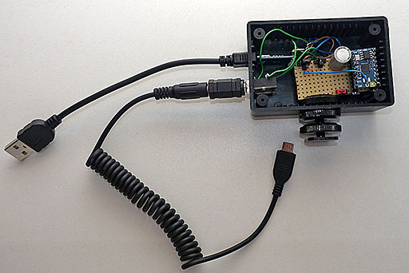
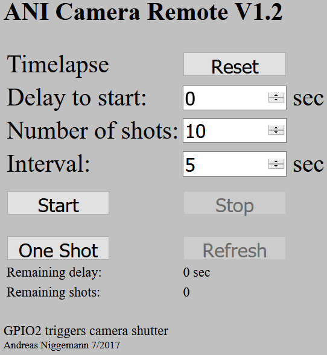
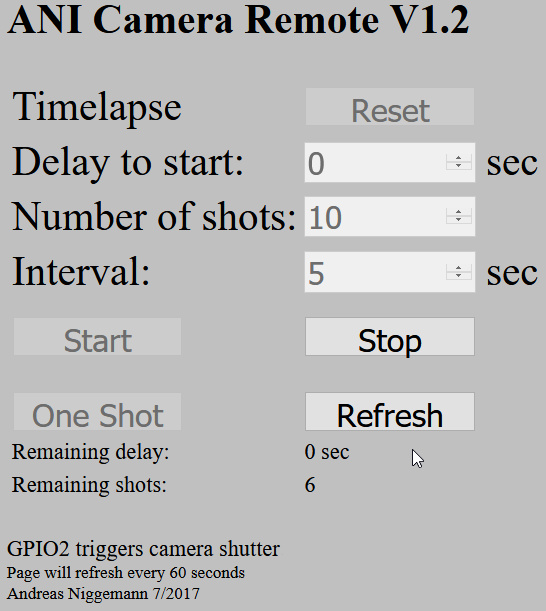
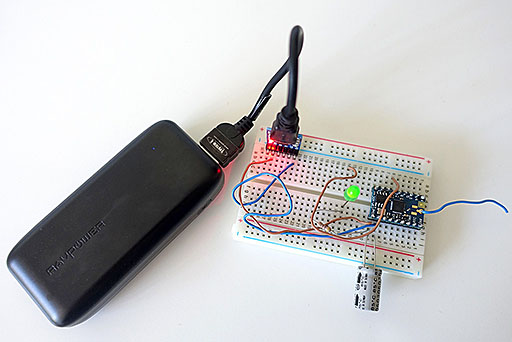

# ANI-Camera-Remote
Remote Control and Timelapse Control of Cameras via [ESP8266](https://en.wikipedia.org/wiki/ESP8266)

The upper cable connects the device to a USB power bank, the lower cable is a remote release cable for Samsung NX cameras

What you need
-
* ESP8266 device ([NodeMCU](https://en.wikipedia.org/wiki/NodeMCU) recommended)
* Power supply (e.g. USB power bank)
  * If a USB power bank is used, a bank with an ON/OFF switch is preferable
* USB cabel to upload the program
* [Arduino IDE](https://www.arduino.cc/en/Main/Software)
* [ESP8266 board manager](http://www.instructables.com/id/Quick-Start-to-Nodemcu-ESP8266-on-Arduino-IDE/)
* Camera that can be controlled by a remote release via push button
* Remote release cable for your camera

What to do
-
* Connect the ESP8266 device via USB cable to your computer
  * Usually Windows will detect the device and assign it a COM port (e.g. COM3)
  * You dont need a special driver software for the CP2102 on Windows 10
* Install the Arduino IDE and the ESP8266 board manager into the IDE
* Load the file ANI_CameraRemote.ino into the IDE
* Compile the file ANI_CameraRemote.ino in the Arduino IDE and upload it to your ESP8266 device simply by pressing CTRL-U in the IDE
  * Sometimes you had to adjust the upload speed (in "Tools" in the IDEs menu)
* Connect the GPIO2 of the ESP8266 device to your remote release 
  * GPIO2 is the fifth pin (from the top, antenna facing up, USB facing down) on the right side of the module
  * Best practice is to buy a cable with a camera connector on one end and a separate connector on the push button end (e.g. 3.5mm jack plug)
  * Connect a matching jack to GPIO2
  * Connect your remote release cable to the jack and the other end to your camera  
* **__Make sure the output of the GPIO is compatible with your camera!__** Use optocoupler or relay between ESP8266 and jack if unsure
* Connect your computer or smartphone to the WiFi network ANI-CameraRemote with the password Remoter12345678
* Open a web browser and browse to the IP address of your ESP8266 device (usually 192.168.4.1)
* Control the remote via the webGUI
* On a NodeMCU the program can be tested without any connection to a camera or an extra LED since NodeMCU contains a LED for GPIO2 onboard
  * Just press "One Shot" in the webGUI and the LED next to the antenna will light up
  * Press "Start" and for 10 times every 5 seconds the LED will light up (timelapse mode)

WebGUI
-
 

Usage
-
* For single shots, press "One Shot"
* To start timelapse, input the delay for the timelapse to start, the number of shots and the time between the shots, then press "Start"
* At any time it is possible to stop the timelapse operation by pressing "Stop"
* Timelapse mode only: "Refresh" will show how many seconds are left to start the timelapse and how many shots are left 
* During timelapse mode the webGUI will refresh its page every 60 seconds
* "Reset" will reset the delay to start, the number of shots and the time between shots to their default values
* There is no need to shutdown the ESP8266, just remove the power

Settings
-
The settings can be changed at the beginning of the file ANI_CameraRemote.ino
* ssid = "ANI-CameraRemote" - WiFi SSID
* password = "Remoter12345678" - Set to "" for open access point w/o passwortd
* webServerPort = 80 - Port for web server
* triggerPin = 2 - GPIO2 as trigger output
* default_delayToStart = 0 - Delay in seconds till start of timelapse
* default_numberOfShots = 10 - Number of shots in timelapse mode
* default_delayBetweenShots = 5 - Delay between shots in timelapse mode
* default_autorefresh = 60 - In timelapse mode autorefresh webGUI every 60 seconds, 0 = autorefresh off

Why you should choose a NodeMCU over any other ESP8266 device
-
* NodeMCU contains everything to start the easy way in ESP8266 programming
  * Standard pin spacing (no SMD soldering)
  * Integrated antenna
  * MicroUSB connector for programming and power supply
  * No need to connect GPIO0 to GND for programming mode
  * Integrated LED on GPIO2
  * No need for an extra CP2102 interface, a CH340G is build in	
  * Programming in LUA or c++
* Support by a large community providing examples and instructions for free
* Easy to mount on a breadboard (better than ESP-01 etc.)
* Low cost (less than 10 Euro)

License
-
This project is licensed under the MIT License - see the [LICENSE](LICENSE) file for details

Prototype
-

Using ESP8266 DIL18 and CP2102 (usually more expensive than a NodeMCU that contains a CP2102)
