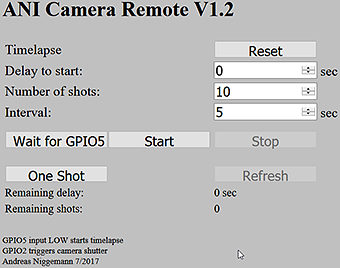
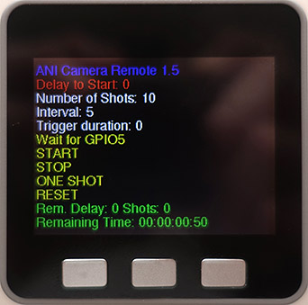

# ANI-Camera-Remote
Remote Control and Timelapse Control of Cameras via [ESP8266](https://en.wikipedia.org/wiki/ESP8266)

[M5Stack variant](#m5stack)

First Remoter | Second Remoter
------------- | -------------
 |
The upper cable connects the device to a USB power bank, the lower cable is a remote release cable for Samsung NX cameras|This is the second unit (using NodeMCU).  It contains the USB power bank, the longer cable is a remote release cable for Sony cameras

What you need
-
* ESP8266 device ([NodeMCU V2](https://en.wikipedia.org/wiki/NodeMCU) recommended)
* Power supply (e.g. USB power bank)
  * If a USB power bank is used, a bank with an ON/OFF switch is preferable
* USB cable to upload the program
* [Arduino IDE](https://www.arduino.cc/en/Main/Software)
* [ESP8266 board manager](http://www.instructables.com/id/Quick-Start-to-Nodemcu-ESP8266-on-Arduino-IDE/). V2.4.1 may cause webserver problems, use V2.4.0 instead
* Camera that can be controlled by a remote release via push button
* Remote release cable for your camera
* Optional: Button or sensor on GPIO5 if you want to start timelapse externally (without WiFi control)

What to do
-
* Connect the ESP8266 device via USB cable to your computer
  * Usually Windows will detect the device and assign it a COM port (e.g. COM3)
  * You dont need a special driver software for the CP2102 on Windows 10
* Install the Arduino IDE and the ESP8266 board manager into the IDE
* Load the file ANI_CameraRemote.ino into the IDE
* Compile the file ANI_CameraRemote.ino in the Arduino IDE and upload it to your ESP8266 device simply by pressing CTRL-U in the IDE
  * Sometimes you had to adjust the upload speed (in "Tools" in the IDEs menu)
* Connect the GPIO2 of the ESP8266 device to your remote release 
  * GPIO2 is the fifth pin (from the top, antenna facing up, USB facing down) on the right side of the module
  * Best practice is to buy a cable with a camera connector on one end and a separate connector on the push button end (e.g. 3.5mm jack plug)
  * Connect a matching jack to GPIO2
  * Connect your remote release cable to the jack and the other end to your camera  
* **__Make sure the output of the GPIO is compatible with your camera!__** Use optocoupler or relay between ESP8266 and jack if unsure
* Connect your computer or smartphone to the WiFi network ANI-CameraRemote with the password Remoter12345678
* Open a web browser and browse to the IP address of your ESP8266 device (usually 192.168.4.1)
* Control the remote via the webGUI
* On a NodeMCU the program can be tested without any connection to a camera or an extra LED since NodeMCU contains a LED for GPIO2 onboard
  * Just press "One Shot" in the webGUI and the LED next to the antenna will light up
  * Press "Start" and every 5 seconds the LED will light up (10 times, timelapse mode)
* Timelapse may started by connecting GPIO5 momentarily to GND (via push button etc.) after pressing the "Wait for GPIO5" in the webGUI

WebGUI
-
Start screen | Autorefresh during intervalls
------------ | -------------
|

Usage
-
* For single shots, press "One Shot"
* To start timelapse, input the delay for the timelapse to start, the number of shots and the time between the shots, then press "Start"
* At any time it is possible to stop the timelapse operation by pressing "Stop"
* Timelapse mode only: "Refresh" will show how many seconds are left to start the timelapse and how many shots are left 
* During timelapse mode the webGUI will refresh its page every 15 seconds
* The remaining time for timelapse mode will be displayed in the form of Days:Hours:Minutes:Seconds
* The total time can be calculated - without starting the timelapse mode - by entering the values for delay, number of shots and interval and then pressing the "Wait for GPIO" button
* "Reset" will reset the delay to start, the number of shots and the time between shots to their default values
* There is no need to shutdown the ESP8266, just remove the power

"Headless" Mode and Autostart
-
* For the "headless" mode, configure all settings in the program and then upload it to the device
* From then on, by triggering the start pin (e.g. GPIO5) the timelapse mode will start with these settings without the need to make a WiFi connection to the device
* Use a push button or a sensor which connect the start pin to GND for a short time
* Timelapse will start only after the low to high transition on the start pin
* This mode comes in handy for wildlife photography etc.
* Autostart works the same way, except a separate trigger on a GPIO pin is not needed
* If autostart is enabled, the timelapse mode will start immediately as soon as power is applied

Settings
-
The settings can be changed at the beginning of the file ANI_CameraRemote.ino
* ssid = "ANI-CameraRemote" - WiFi SSID
* password = "Remoter12345678" - Set to "" for open access point w/o password
* webServerPort = 80 - Port for web server
* screenSaverTime = 60 - After 60 seconds of inactivity the display will be turned off (M5Stack only)
* triggerPin = 2 - GPIO2 as trigger output
* startPin = 5 - GPIO5 as start input for timelapse, -1 = deactivate input pin processing
* default_delayToStart = 0 - Delay in seconds till start of timelapse
* default_numberOfShots = 10 - Number of shots in timelapse mode
* default_delayBetweenShots = 5 - Delay between shots in timelapse mode
* default_autorefresh = 15 - In timelapse mode autorefresh webGUI every 15 seconds, 0 = autorefresh off
* timelapseAutoStart = 0 - Autostart timelapse mode = 1, No autostart = 0

Why you should choose a NodeMCU over any other ESP8266 device
-

* NodeMCU contains everything to start the easy way in ESP8266 programming
  * Standard pin spacing (no SMD soldering)
  * Integrated antenna
  * MicroUSB connector for programming and power supply
  * No need to connect GPIO0 to GND for programming mode
  * Integrated LED on GPIO2
  * No need for an extra CP2102 interface, a CH340G is build in	
  * Programming in LUA or C++
* Support by a large community providing examples and instructions for free
* Easy to mount on a breadboard (better than ESP-01 etc.)
* Low cost (less than 10 Euro)
* Try to get a version 2 (V2) variant of NodeMCU
* V3 made by LiLon is much larger and will cover all lines on a breadboard

# M5Stack

The M5Stack provides a casing, buttons and a display. This allows us to construct a self-contained Camera-Remote without the need for a WiFi connection.
* Install the M5Stack from the project web site ([M5Stack on Github](https://github.com/m5stack/M5Stack))
* Choose the M5Stack board in Arduino IDE
* Set the COM port where the M5Stack is connected to
* Compile and upload ANI_CameraRemote.ino to the M5Stack
 * The sketch takes care of the correct board by conditional compile for ESP8266 or EPS32 (M5Stack)
* Connect GPIO2 and GND to the camera. Pin assignment can be found on the bottom of the M5Stack

Usage
-
* The right button (button C) moves the selector (red line) down
* The left button (button A) increases the value (white lines) or activates the function (yellow lines)
* The middle button (button B) decreases the value (white lines) or activates the function (yellow lines)
* Value change can be speed up by pressing and holding the direction button (A or B) and then pressing and holding button C
* The screen will go blank after 60 seconds (s. settings) and can be activated again by pressing any button (A,B or C)
* The M5Stack can be turned off by double clicking the red button on the side of the unit
* Pressing and holding the C button for 5 seconds activates the Configuration Menu
  * WiFi can be turned ON (standard is OFF after starting the ANI-Camera-Remote on the M5Stack)
  * WiFi can be turned OFF. This will result in a restart as well
* The WiFi connection and webGUI can be used in parallel to the M5Stack UI  
* Turning off the WiFi reduces the energy consumption

License
-
This project is licensed under the MIT License - see the [LICENSE](LICENSE) file for details

Prototype
-

Using ESP8266 DIL18 and CP2102 (usually more expensive than a NodeMCU that contains a CP2102)
